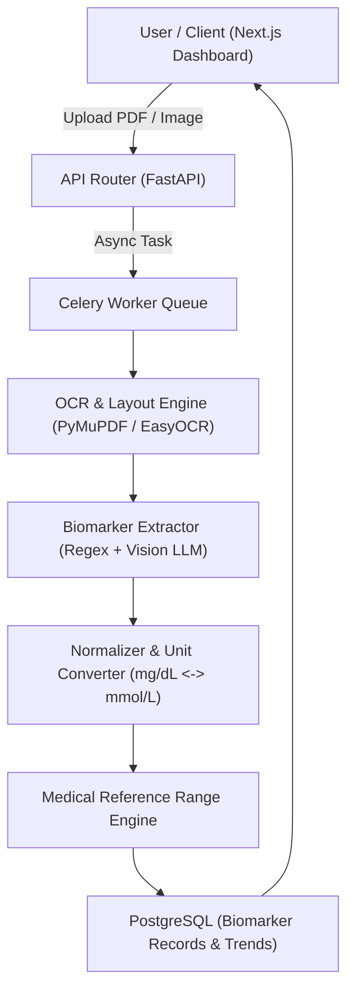

# System Architecture & Data Flow

## 1. High-Level Architecture

The Blood Test Intelligence platform processes unstructured lab report documents (PDFs, scans, images) into structured, standardized biomarker time-series data with conditional medical risk evaluation.

## 2. Component Responsibilities

### `backend/app/intelligence/`
- **`ocr/`**: Responsible for converting PDF pages to clean images, extracting raw text, and maintaining spatial bounding box layout metadata.
- **`extractors/`**: Applies deterministic regex models first, then falls back to Vision LLMs for complex, non-standard lab formats (e.g., Quest Diagnostics, LabCorp, local clinic layouts).
- **`normalizers/`**: Maps vendor-specific test names (e.g. "HbA1C", "Glycated Hemoglobin", "A1c") to canonical LOINC/SNOMED terminology, converting measurement units to unified standard metrics.
- **`medical_ref/`**: Holds reference range rules conditional on Age, Gender, Pregnancy status, and Fasting state.
- **`analytics/`**: Evaluates multi-test trends over time, flagging persistent abnormalities and generating actionable summaries.
